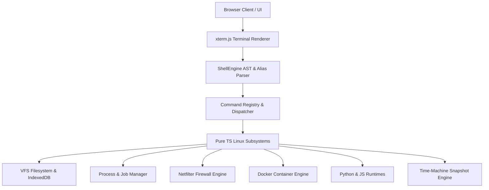

# 🌌 Earendel - Pure TypeScript Web Linux Terminal

> **A browser-native, zero-backend, ultra-realistic Linux terminal emulator designed for education, interactive learning, and geek culture.**

[](https://opensource.org/licenses/MIT)
[](https://www.typescriptlang.org/)
[](https://react.dev/)
[](https://vitejs.dev/)

**Earendel** is an open-source, client-side Linux terminal OS simulator built entirely in pure TypeScript. Running 100% inside your browser without any server backend execution, Earendel provides an authentic Linux TTY environment with virtual file persistence, real-time command chaining, native script interpreters, and geek easter eggs.

---

## 🌟 Key Highlights

- **⚡ 100% Pure Client-Side Execution**: Zero backend server overhead. All command evaluations, AST parsing, and shell operations execute inside browser WebAssembly & V8 engines.
- **🐧 Official Linux FHS & Persistent VFS**: Fully implemented **Filesystem Hierarchy Standard** (`/bin`, `/boot`, `/dev`, `/etc`, `/home`, `/lib`, `/opt`, `/usr`, `/var`). Includes IndexDB persistence and `/var/log/syslog` boot logs.
- **🐳 Virtual Docker Container Suite**: Emulates Docker CLI (`docker ps`, `docker ps -a`, `docker images`, `docker run -it`, `docker stop`, `docker rm`).
- **🐍 Native Python 3 & Node.js Runtimes**: Execute `.py` files with loops, variables, and math, or run `.js` scripts directly on browser V8 with custom `console.log` and `process.argv` handling.
- **🖥️ `tmux` Terminal Window Multiplexer**: Split your browser screen vertically (`tmux split`) or horizontally (`tmux split-h`) into multiple independent active terminal sessions.
- **💾 Time-Machine Snapshot Engine**: Create full VFS state snapshots (`snapshot save init`) and restore/rollback your system instantly (`snapshot restore init`).
- **🔥 Netfilter Firewall (`ufw` & `iptables`)**: Simulate network security rules blocking dynamic `curl` or `ping` requests in real-time.
- **🎨 5 Sleek Terminal Color Presets**: Switch instantly with `theme` between `default`, `matrix`, `dracula`, `cyberpunk`, and `monokai`.
- **💖 Geek Easter Eggs**:
  - `tell <name>`: Express feelings with neon ANSI ASCII fireworks!
  - `rm -rf /`: Protected by Earendel Failsafe Protocol nuclear bomb easter egg!
  - `sl`: Classic steam locomotive animation.
  - `figlet`: 3D ASCII banner font generator.

---

## 🚀 Quick Start

### Prerequisites
- [Node.js](https://nodejs.org/) (v16.0 or higher)
- [npm](https://www.npmjs.com/) or [pnpm](https://pnpm.io/)

### Installation & Local Run

```bash
# Clone the repository
git clone https://github.com/techarts0/earendel.git

# Navigate into the project directory
cd earendel

# Install dependencies
npm install

# Start local development server
npm run dev
```

Open your browser and visit `http://localhost:3000`. Login with username `hello` and password `123456`!

---

## 💻 Supported Commands Overview

| Category | Commands |
| :--- | :--- |
| **File Management** | `ls`, `pwd`, `cd`, `cat`, `touch`, `mkdir`, `rm`, `cp`, `mv`, `head`, `tail`, `wc`, `find`, `which`, `whereis`, `locate` |
| **Permissions & Users** | `chmod`, `chown`, `whoami`, `who`, `id`, `useradd`, `userdel`, `su`, `sudo`, `login`, `umask` |
| **Interpreters** | `python3` (or `python`), `node` (or `js`) |
| **Text Editors** | `vi` (or `vim`), `nano` |
| **Networking & Security** | `ping`, `curl`, `ufw`, `iptables`, `tcpdump`, `traceroute` |
| **Container & Process** | `docker`, `ps`, `top`, `kill`, `systemctl`, `apt`, `df`, `free`, `uptime` |
| **Multiplexer & Snapshot**| `tmux`, `snapshot` (`backup`, `restore`) |
| **Geek & Customization** | `theme`, `sound`, `man`, `alias`, `unalias`, `cheat`, `tell`, `sl`, `figlet` |

---

## 🛠️ System Architecture



---

## 📜 License

Distributed under the **MIT License**. See `LICENSE` for more information.

---

<p center="align">
  <i>Crafted with ❤️ for students, terminal lovers, and geek culture enthusiasts worldwide.</i>
</p>
